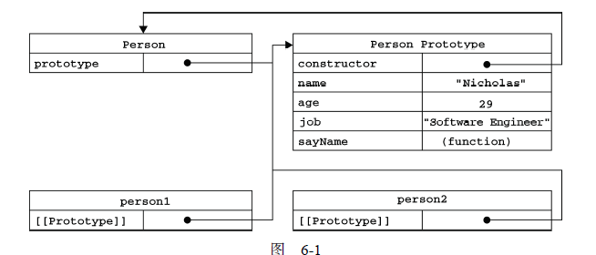

# JS-OOP-Customized Type

## JS OO(OOP) 必须熟练口诀/要领
- 对象是属性的(无序?)集合
- 方法属性化, 即 *Built-in Type* **Function**对象, 函数对象(**function**基本与其同义)
- 没有**class**, **struct**关键字, 有**Ctor**, 有**如下**
- **Ctor** **构造函数** **构造函数对象** 即 **类型** **Type**
- 证据
    - 运算符:  obj instanceof T <=> obj.constructor == T(来自原型对象)
    - T 即所谓类型, 而实际为 **如上**, 只有 **Ctor**

<!--more-->

## 属性 + Qualifier(Property)
- 数据 Qualifier: configurable, enumerable, writable, value
- getter / setter Qualifier: configurable, enumerable, get, set
- Object.defineProperty(obj, attribute, obj_withkey_qualifiers) 用于修改或创建
- **__**  下划线属性  <=> 实例访问而非原型


## 工厂模式

- 典型实例
```JavaScript
function createPerson(name, age, job)
{
    var o = new Object();
    o.name = name;
    o.age = age;
    o.job = job;
    o.sayName = function()
    {
    	alert(this.name);
	};
	return o;
}
var person1 = createPerson("Nicholas", 29, "Software Engineer");
var person2 = createPerson("Greg", 27, "Doctor");
```

## Ctor模式 (工厂模式高级版 使用函数内部属性this)
- 典型实例
```JavaScript
function Person(name, age, job)
{
    this.name = name;
    this.age = age;
    this.job = job;
    this.sayName = function()
    {
    	alert(this.name);
    };
}
```

- 注意
   - var o = new T(...)
   - 直接调用T()添加到Global
   - T.call() / T.apply() 会让类型无法抽象(**个人认为**)
   - 函数代码在堆内大量重复

## 原型模式(解决同一类型的不同实例代码共用问题)
- 典型实例见下图



- 由对象得原型
   - Object.getPrototypeOf(obj)
- 有类型得原型
   - T.prototype
- 原型属性
   - constructor(解释器自动生成)

- 要理解
   - 对象访问属性/方法时优先实例, 然后原型, 实例属性可以覆盖原型属性
   - delete 运算符删除实例属性, 暴露原型重新(注意Qualifier)

- 实例/原型判定
   - obj.hasOwnProperty(属性) <=> 实例属性 true
   - 属性 in obj <=> 实例 + 原型 true
   - for-in 循环 <=> 所有 JS Object 所有实例/原型 enumerable == true
   - *PS: Array 可迭代不足为奇, Python Iterable Object / built-in ds 是另一种风格的美*
   - obj.keys() <=> 所有实例属性Array
   - obj.getOwnPropertyNames() <=> 实例+原型 Array

- 原型书写
   - T.prototype.\*  =  \*   引用关系未变, 解释器生成的constructor绑定正确
   - T.prototype = 显/隐 构造, 要自己写constructor, 否则证据出问题, 很奇怪啊! 
   - 还有enumerable == false 的兼容问题
   - 注意扫描自上而下与动态原型的解释  =>  **要理解** 章节

- 问题
   - 单一原型模式, 构造函数为
       ```JavaScript
       		function T()
       		{
                
       		}
       ```
   - 实例代码共用 => 构造函数为例 => 都初始化为***SAME***, ***且不可传参*** YES!
   - 原型属性为引用类型 => 伪构造啊 => OOP static 了!
## Ctor与原型共用模式
- 构造函数要写东西
  - 实例属性, ***构造可传参***, ***DIFFERENT***
- 原型要写东西
  - ***CPP: 处Ctor, Dtor之外的成员函数***
## 其他模式